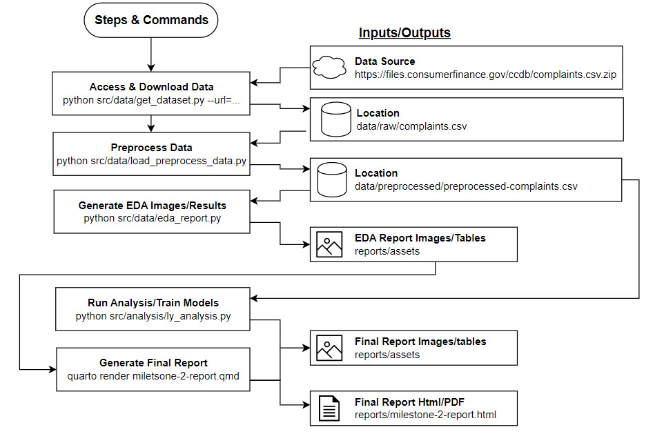

# Customer Complaint Predictor

Authors:  
- Ty Andrews  
- Dhruvi Nishar  
- Luke Yang  

A data science project for DSCI 522 (Data Science workflows); a
course in the Masters of Data Science program at the University of
British Columbia.
## Report

The final report is located [here](https://ubc-mds.github.io/customer_complaint_analyzer/reports/final_report.html)

## Project proposal

We aim to investigate, analyze, and report using the [customer complaint dataset](#References)[1]. This dataset is published in in DATA.GOV and it is intended for public access and use. This dataset is a collection of customer complaints regarding their purchased financial products. It contains information on the summary and content of the complaint, the responses from the companies, and whether the customer disputed after companies response.

We aim to answer the following inferential and/or predictive questions: 
- **Can we predict whether a customer is going to dispute based on their complaint and the company's response?** This question may induce inferential sub-questions such as
- **What kind of response from the company is most likely to prevent the customer from disputing the service?**
- **When submitting a claim what is your probability of getting monetary compensation, responses in a timely manner etc. to give to consumers when submitting a complaint**
- **What kind of complaint cannot be easily resolved?** We will focus on the main question and target the subproblem if we have time.

We plan to analyze the data using a mix of tabular and natural language processing tools like the bag-of-words representation and apply proper numerical or categorical transformations to the customer's responses. We plan to construct the classification model using scalable models like `Naive Bayes` or `Ridge` regression. Given the size of the data, it might be challenging to apply complex models to train in the time we have. We may try complex models with a partition of the dataset to see the performance of other models.

Our exploratory analysis will mainly look into the company's responses rather than the customer's complaints. We will first split the data into training and test set. In the training set, we will visualize if the class is imbalanced to find the strategy of model building. A visualization determining whether a large number of unique values appear in a column will be created. 

## Requirements

The requirements for package installation is encompassed in the `requirements.txt` for `pip` users and and `environment.yml` for Conda users.

To set up the environment in Conda run:
```
conda env create -n complaints -f environment.yml
```

Or for `pip`:  
```
pip install -r requirements.txt
```

To update the `environment.yml` file you can run the following command if using a Conda environment:
```
conda env export --no-builds > environment.yml
```

To output a pip formatted `requirements.txt` use the following command to generate one from a Conda environment:

```
pip list --format=freeze > requirements.txt
```

## Dependencies
For the project to be correctly run, the following packages need to be installed. If the steps from the above could not be executed corrected, please make sure you have the following packages available in your environment by manual installation:

  - Python 3.7.3 and Python packages:
      - altair==4.2.0
      - numpy==1.23.5
      - pandas==1.4.4
      - pytest==7.2.0
      - requests==2.28.1
      - scikit_learn==1.1.3
      - docopt-ng==0.8.1
  - R version 4.2.1 and R packages:
      - tidyverse==1.3.2
  - [GNU make 4.3](https://downloads.sourceforge.net/project/ezwinports/make-4.3-without-guile-w32-bin.zip)
  - [quarto CLI](https://quarto.org/docs/get-started/)


## Usage


Here is how the analysis process works:


To start from the base repo and access, clean, analyze and generate the final reports you can run the following command from the
root directory of this project. Note that it is OK to observe `UserWarning` during the model training:
```
make
```
Running the following command from the
root directory of this project could clean up the analysis to its initial state:
```
make clean
```
If the single `make` command did not work, we here also provide a step-by-step prodecure on how to reproduce the analysis:

```
# Accessing and downloading the raw data
python src/data/get_dataset.py --url=https://files.consumerfinance.gov/ccdb/complaints.csv.zip

# Cleaning & preprocessing the raw data
python src/data/load_preprocess_data.py --raw_path="data/raw/complaints.csv" --output_path="data/processed/preprocessed-complaints.csv"

# Generating the EDA results 
python src/data/generate_eda.py --train=data/processed/preprocessed-complaints.csv --out_dir=reports/assets

# Running the analysis
python src/analysis/analysis.py --data_filepath=data/processed/preprocessed-complaints.csv --out_filepath=reports/assets

# Genrating the final report
# ON windows where quarto.exe is not found in path from git bash
quarto.cmd render reports/final_report.qmd --to html --data-dir="reports/final_report.html"
# Or on Mac/Linux with Quarto in path
quarto render reports/final_report.qmd --to html --data-dir="reports/final_report.html"
```

## Contributing

Contributions are what make the open-source community such an amazing place to learn, inspire, and create. Any contributions you make are greatly appreciated.

Please advise `CONTRIBUTING.md` for detailed information.
## License

Distributed under the MIT License. See `LICENSE.txt` for more information.

# References

<div id="refs" class="references hanging-indent">

<div id="ref-Dua2019">

[1] Publisher Consumer Financial Protection Bureau. (2020, November 10). Consumer complaint database. Catalog. Retrieved November 18, 2022, from https://catalog.data.gov/dataset/consumer-complaint-database 


</div>

</div>
