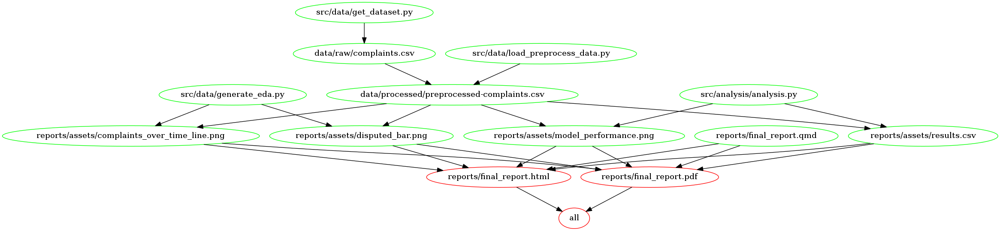

# Customer Complaint Predictor

Authors:  
- Ty Andrews  
- Dhruvi Nishar  
- Luke Yang  

A data science project for DSCI 522 (Data Science workflows); a
course in the Masters of Data Science program at the University of
British Columbia.

## About

We aim to investigate, analyze, and report using the [customer complaint dataset](#References)[1]. This dataset is published in DATA.GOV and it is intended for public access and use. This is a collection of customer complaints regarding their purchased financial products and services that were sent to companies for response. It contains information on the summary and content of the complaint, the responses from the companies, and whether the customer disputed after companies response. It contains important information about the issues and the sub-issues of the complaints, details about how the company responded to them and which states/zip codes they are from and whether the customer was disputed or not after the company's response.


We want to answer the following inferential and/or predictive questions for our analysis: 
- **Can we predict whether a customer is going to dispute based on their complaint and the company's response?** This question may induce inferential sub-questions such as
- **What kind of response from the company is most likely to prevent the customer from disputing the service?**
- **When submitting a claim what is your probability of getting monetary compensation, responses in a timely manner etc. to give to consumers when submitting a complaint**
- **What kind of complaint cannot be easily resolved?** 
We will focus on the main question and target the subproblem with time permitting.

We plan to analyze the data using a mix of tabular and natural language processing tools like the bag-of-words representation using a `CountVectorizer()` and apply proper numerical or categorical transformations to the customer's responses. We plan to construct the classification model using scalable models like `Naive Bayes` or `LogisticRegression`. The analysis scripts can be found in the `src` directory and the html report is supplied below.


## Report

The final report is located [here](https://ubc-mds.github.io/customer_complaint_analyzer/reports/final_report.html)


## Usage

Here is how the make analysis process works:

There are two ways of replicating the analysis:
### Run with Docker 

To start from the base repo and access, clean, analyze and generate the final reports, you can use [Docker](https://www.docker.com/get-started). Install Docker desktop for your system and execute the following steps

1. Clone the repository using Git, and navigate to the repository so you're in the `customer_complaint_analyzer` directory.

2. From inside the customer_complaint_analyzer directory in your terminal then run the following command:

```
docker run --rm -v "/$(pwd):/home/jovyan/customer_complaint_analyzer" tannedruse101/customer_complaint_analyzer make -C '//home/jovyan/customer_complaint_analyzer' all
```

To reset the repo to a clean state, with no intermediate or results in files, run the following command at the command line/terminal from the
root directory of this project:

```
docker run --rm -v "/$(pwd):/home/jovyan/customer_complaint_analyzer" tannedruse101/customer_complaint_analyzer make -C '//home/jovyan/customer_complaint_analyzer' clean
```


### Run Analysis with Make

For the project to be correctly run using `make`, the following packages need to be installed. If the steps from the above could not be executed corrected, please make sure you have the following packages available in your environment by manual installation:

  - Python 3.10.8 and Python packages:
      - altair==4.2.0
      - numpy==1.23.5
      - pandas==1.4.4
      - pytest==7.2.0
      - requests==2.28.1
      - scikit-learn==1.1.3
      - docopt-ng==0.8.1
  - R version 4.2.1 and R packages:
      - tidyverse==1.3.2
  - [GNU make 4.3](https://downloads.sourceforge.net/project/ezwinports/make-4.3-without-guile-w32-bin.zip)
  - [quarto CLI](https://quarto.org/docs/get-started/)

The requirements for package installation are encompassed in the `requirements.txt` for `pip` users and and `environment.yml` for Conda users.

To set up the environment in Conda run:
```
conda env create -n complaints -f environment.yml
```

Or for `pip`:  
```
pip install -r requirements.txt
```


The following command will execute the sequence of analysis. Note that it is OK to observe `UserWarning` during the model training:
```
make
```
Running the following command from the
root directory of this project could clean up the analysis to its initial state:
```
make clean
```

## Contributing

Contributions are what make the open-source community such an amazing place to learn, inspire, and create. Any contributions you make are greatly appreciated.

Please advise `CONTRIBUTING.md` for detailed information.
## License

Distributed under the MIT License. See `LICENSE.txt` for more information.

# References

<div id="refs" class="references hanging-indent">

<div id="ref-Dua2019">

[1] Publisher Consumer Financial Protection Bureau. (2020, November 10). Consumer complaint database. Catalog. Retrieved November 18, 2022, from https://catalog.data.gov/dataset/consumer-complaint-database 


</div>

</div>
